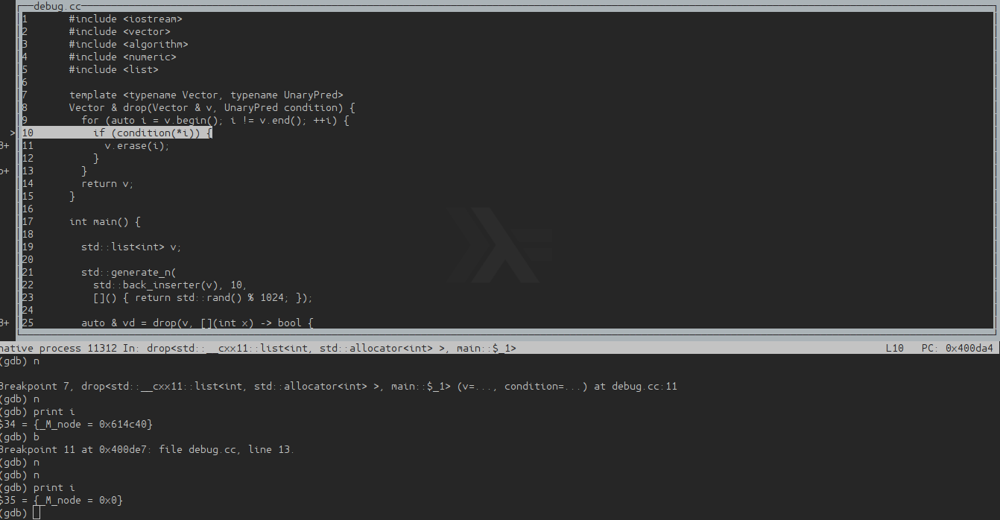

## Midterm Assignment - Alexander Isenko

### 1. Types, Classes, Objects and their State
#### 1.1 Object Definition
> Assuming your are confronted with a class that supports the following use case:
> ```c++
> DateParser date_parser;
> date_parser.set_date(today);
> 
> auto day = date_parser.day_of_week()
> ```
>
> Q: What is your objection to this? How would you change the interface of class `DateParser`?

**Answer:** The method `day_of_week` is not valid without the previous `set_date` call.
I would enforce to use a constructor with the argument `today`.


#### 1.2 Standard Object Semantics

> Given the following implementation of class `SemanticSurprise`:
> 
> ```c++
> class SemanticSurprise {
> public:
> 
>   SemanticSurprise(int value)
>   : _value(value) { }
> 
>   SemanticSurprise(const SemanticSurprise & other)
>   : _value(other._value) { } 
> 
>   bool operator==(const SemanticSurprise & other) const {
>     return _value == other._value;
>   }
> 
>   int value() {
>     return _value;
>   }
> 
> private:
>   int _value;
> };
> ```

> Q: Are there any compiler errors? If so: why?

**Answer:** There are none. (The following code was not included in this answer)

> ```c++
> 1  SemanticSurprise s1;          // <-- Op?
> 2  s1.value();                   // <-- value?
> 3
> 4  SemanticSurprise s2(4);       // <-- Op?
> 5  s2.value();                   // <-- value?
> 6
> 7  SemanticSurprise s3 = s2;     // <-- Op?
> 8  s3.value();                   // <-- value?
> 9
> 10 SemanticSurprise s4(s3);      // <-- Op?
> 11 s4 == s3;                     // <-- value?
> 12 s2 != s3;                     // <-- value?
> ```

> Q: Name the method/operation on SemanticSurprise in every line marked with Op?, including those that lead to compiler errors.

**Answer:** 
* Line 1, there is a default constructor missing (compile error)
* Line 4, the custom constructor is called
* Line 7, s3 is allocated, copy constructor is called
* Line 10, copy constructor is called

> Q: Which values are returned in the lines marked with value? (given the line does not lead to a compiler error). Explain why these values are returned.

**Answer:**
* Line 2, if this would compile, it should return garbage. (not specified in standart, `g++` returns garbage, `clang++` returns `0`)
* Line 5, returns `4`
* Line 8, returns `4`, because the copy constructor got the value from `s2`
* Line 11, returns `1`, stands for `true`
* Line 12, returns `0`, if this would compile and derive the `operator!=` from `operator==`

> Q: How can this implementation be simplified? What is the requirement for this simplification?

**Answer:**

We could remove the explicit copy constructor (see Rule of Zero).
If we would want that everything compiles, we have to create a constructor and an `operator!=`:  [Code](1-2/1-2.cc)

```c++
class SemanticSurprise {
public:

  SemanticSurprise()
  : _value(0) { }

  SemanticSurprise(int value)
  : _value(value) { }

  bool operator==(const SemanticSurprise & other) const {
    return _value == other._value;
  }

  bool operator!=(const SemanticSurprise & other) const {
    return !(*this == other);
  }

  int value() {
    return _value;
  }

private:
  int _value;
};
```

> Given the implementation of SemanticSurprise above, the following use case leads to a compiler error:
>>
> ```c++
> void print_surprise(const SemanticSurprise & s) {
>   std::cout << "SemanticSurprise.value: " << s.value() << std::endl;
> }
> print_surprise(SemanticSurprise(10));
> ```
>
> Q: Explain the compiler error and how the implementation of SemanticSurprise has to be corrected.

**Answer:**

The problem is the `const` identifier in the argument of `print_surprise`. We call `value()` in this function and the compiler can't be sure that this doesn't modify the object. We have to append the `const` keyword to signal the compiler that the use of this function does not change the object in any way. [Code](1-2/1-2.cc)

```c++
class SemanticSurprise {
public:
...
  int value() const {
    return _value;
  }
...
```

#### 1.3 Resource Ownership

> Consider the following use case:
> 
> ```c++
> // ...
> if (condition) {
>         LogFileReader log_reader("performance.log");
>         if (log_reader.lines().size() > 1024) { return; }
> }
> // ...
> ```
> 
> Q: Judging from its usage illustrated above: which rule must be satisfied in the implementation of class LogFileReader (or one of its members)?

**Answer:**
The Rule of Zero/Three/Five should be satisfied, because if an exception happens after the `LogFileReader` aquired the resource `"performance.log"` it should release it without a doubt. If the destructor it not defined properly, this leads to resource leaks.

> Q: Name a popular technique in resource management that depends on this rule, and briefly explain its principle.

**Answer:**
This technique/iodom is called **RAII** (*Resource acquisition is initialization*) and states that resource allocation happens in the initialization phase and the release of resources happens by the destructor. This means that if there are no object leaks, there aren't any resource leaks.

#### 1.X Bonus

> Have a look at this example code from the lecture “CMSC 12300 - Computer Science with Applications 3” at University of Chicago:
> 
> ```c++
> #include"basefrequentflyer.h"
> #include"frequentflyer.h"
> #include"silverfrequentflyer.h"
> #include"goldfrequentflyer.h"
> #include<iostream>
> using namespace std;
> 
> int main()
> {
>   BaseFrequentFlyer* f[3];
>   
>   f[0] = new FrequentFlyer ("Cornelius Doe", 23166841, 100);
>   f[1] = new SilverFrequentFlyer ("Lucius Doe", 94565432, 100, 5);
>   f[2] = new GoldFrequentFlyer("Rufus Doe", 32155994, 100, 100);
> 
>   f[0]->addMiles(100);
>   f[1]->addMiles(100);
>   f[2]->addMiles(100);
> 
>   f[0]->printData();
>   f[1]->printData();
>   f[2]->printData();
>   
>   delete f[0];
>   delete f[1];
>   delete f[2];
> }
> ```
> 
> Q: Do you have any objections? Improve the implementation.

**Answer**

This would be my implementation: [Code](1-X/1-X.cc)


```c++
// some boilerplate to check validity
#include <vector>
#include <algorithm>
#include <iostream>
#include <string>

class BaseFrequentFlyer {
public:

  BaseFrequentFlyer()
  : _name("")
  , _number(0)
  , _miles(0) { }

  BaseFrequentFlyer(std::string name, int number, int miles)
  : _name(name)
  , _number(number)
  , _miles(miles) { }

  void addMiles ( int realMiles ) { _miles += realMiles; }
  void printData ()
  {
      std::cout << "Name: " << _name << std::endl;
      std::cout << "Number: " << _number << std::endl;
      std::cout << "Miles: " << _miles << std::endl;
  }

protected:
  std::string _name;
  int         _number;
  int         _miles;

};

class FrequentFlyer : public BaseFrequentFlyer {
public:
  FrequentFlyer(std::string name, int number, int miles)
  : BaseFrequentFlyer(name, number, miles) { }
};

class SilverFrequentFlyer : public FrequentFlyer {
public:
  SilverFrequentFlyer(std::string name, int number, int miles, int years)
  : FrequentFlyer(name, number, miles), _years(years) { }

private:
  int _years;
};

class GoldFrequentFlyer : public FrequentFlyer {
public:
  GoldFrequentFlyer(std::string name, int number, int miles, int years)
  : FrequentFlyer(name, number, miles), _years(years) { }

private:
  int _years;
};

// implementation starts here

int main()
{
    std::vector<BaseFrequentFlyer> f { FrequentFlyer ("Cornelius Doe", 23166841, 100)
                                     , SilverFrequentFlyer ("Lucius Doe", 94565432, 100, 5)
                                     , GoldFrequentFlyer("Rufus Doe", 32155994, 100, 100) };

    for_each(f.begin()
           , f.end()
           , [](BaseFrequentFlyer & flyer)
           {
             flyer.addMiles(100);
             flyer.printData();
           });
}
```

> Q: Also: what is the most important guideline on the use of new and delete that comes to your mind? (hint: session 02)

**Answer**: Never use `new` and `delete`. Follow the Rule of Zero/Three/Five.

### 2. Container Types, Class Template Basics

### 3. Iterators

#### 3.1 Algorithm Basics

> The following algorithm dereferences and returns a given iterator’s successor unless the successor’s referenced value matches some condition. The algorithm is semantically correct but does not compile for iterators of some containers.

> ```c++
> template <typename Iterator, typename Value = typename Iterator::value_type>
> Value next_value_or_default(Iterator it, Iterator end, Value default) {
>   if (it == end || it+1 == end) { return default; }
>   return it[1];
> }
> ```

> Q: Which containers? Briefly explain why the algorithm does not work for these and how it has to be changed.

**Answer**:
We need at least a `RandomAccessIterator`, because we make use of `it+1` and `it[1]`. Does not compile for
* `istream`
* `ostream`
* `inserter`
* `forward_list`
* `unordered_map`
* `unordered_set`
* `list`

The code should be changed to:
```c++
#include <iterator>

template <typename Iterator, typename Value = typename Iterator::value_type>
Value next_value_or_default(Iterator it, Iterator end, Value default) {
  std::advance(it, 1);
  if (it == end ) { return default; }
  return *it;
}
```

#### 3.2 Container Wrapper

> The STL’s `std::vector` guarantess that its elements are stored in a contiguous memory region and is therefore compatible to C-style arrays. The member function .data() returns a pointer to the vector’s underlying raw memory.
>
> For many hardware-tuning techniques, data is accessed in chunks. Assuming a `std::vector<uint32_t>` and 64 bytes per cache line, for example, vector elements could be loaded in chunks of 64/(32/8) = 16 elements.

> Write a container wrapper `cpppc::chunks<B, T, Container>` that provides a sequential container interface on elements in Container in chunks of maximum size B bytes.

**Answer**:

I interpreted the question in two different ways, one was a "cached vector", which feels like a vector, but stores the data in fixed sized arrays to caching can take place [chunks.h](3-2/elements-iterator/chunks.h) and [main.cc](3-2/elements-iterator/main.cc). The solution which works for the predefined code (which had to be adjusted a little) is found here [chunks.h](3-2/chunks-iterator/chunks.h) and [main.cc](3-2/chunks-iterator/main.cc).

This is the second solution:
```c++

#ifndef CPPPC__CHUNKS_H__INCLUDED
#define CPPPC__CHUNKS_H__INCLUDED

#include <vector>
#include <array>
#include <cstdlib>

namespace cpppc {

namespace detail {

template <class ContainerT>
class delegate_iterator
{
public:
  
  using self_t          = delegate_iterator<ContainerT>;
  using element_t       = typename ContainerT::value_type;

  using iterator_category = std::random_access_iterator_tag;
  using difference_type   = typename ContainerT::difference_type;
  using value_type        = element_t;
  using pointer           = element_t *;
  using reference         = element_t &;

public:
   delegate_iterator() = delete;
   delegate_iterator(ContainerT & container)
   : _container(container)
   , _pos(0) // a chunk.begin() starts always at the first position,
             // even if it was already traversed a bit in the previous iterator
   { }

public:

  inline element_t & operator*()
  {
    return _container[_pos];
  }

// ... generic iterator stuff, like ++, ==, etc.

private:
  ContainerT &    _container;
  difference_type _pos;
};


template <class ChunksT>
class chunks_iterator
{
public:
  using self_t          = chunks_iterator<ChunksT>;
  using element_t       = typename ChunksT::chunk_t;

  using iterator_category = std::random_access_iterator_tag;
  using difference_type   = typename ChunksT::difference_type;
  using value_type        = element_t;
  using pointer           = element_t *;
  using reference         = element_t &;

public:
  using iterator           = delegate_iterator<element_t>;
  using inner_element_t    = typename ChunksT::value_t;
  using inner_difference_t = typename ChunksT::index_t;

  friend iterator;

public:
  chunks_iterator() = delete;
  chunks_iterator(ChunksT & chunks, difference_type pos)
  : _chunks(chunks)
  , _pos(pos) { }


public:
  inline element_t & operator*()
  {
    element_t & chunk = _chunks._chunks[_pos];
    return chunk;
  }

// ... generic iterator stuff, like ++, ==, etc.

  iterator begin() const {
    return iterator(_chunks._chunks[_pos]);
  }

  iterator end() const {
    return iterator(_chunks._chunks[_pos]);
  }

  inline inner_element_t operator[](int offset) const {
    return *(begin() + offset);
  }

private:
//  this can be used to calculate the offsetted beginning of the chunks, if needed
//  const std::ldiv_t get_current_chunk_info() const
//  {
//    return std::div(static_cast<long>(_pos), static_cast<long>(_max_bounds));
//  }

private:
  ChunksT &       _chunks;
  difference_type _pos = 0;
};

}; // namespace detail

template <std::size_t B, class T, class Container>
class chunks
{

public:
  using self_t          = chunks<B, T, Container>;

  using chunk_t         = std::array<T,B>;
  using chunk_ref       = chunk_t &;
  using chunk_const_ref = const chunk_t &;
  using chunk_index_t   = size_t;

  using value_t         = T;
  using reference       = T &;
  using const_reference = const T &;
  using index_t         = size_t;

public:
  using iterator        = detail::chunks_iterator<self_t>;
  using difference_type = chunk_index_t;

  friend iterator;

public:
  chunks(Container container)
  { 
    int i = 0;
    std::for_each(container.begin()
                 ,container.end()
                 ,[&](T & item){

                    if (_chunks.empty() ||  i >= B)
                    { 
                      _chunks.push_back(std::array<T, B> {{ item }});
                      std::cout << "Created new array with: " << item << '\n';
                      i = 1;
                    } else
                    {
                      _chunks.back()[i] = item;
                      std::cout << "Appended to array: " << item << '\n';
                      ++i;
                    }
                  });

    _end = iterator(*this, _chunks.size());
  }

  iterator begin() { return _begin; }
  iterator end()   { return _end;   }

  inline chunk_t operator[](int offset) const {
    return _chunks[offset];
  }

private:
  std::vector<std::array<T,B>> _chunks;

  iterator _begin = iterator(*this, 0);
  iterator _end   = iterator(*this, 0);
};

} // namespace cppp

#endif
```

`main.cc`
```c++
#include <vector>
#include <iostream>
#include <cstdint>
#include <algorithm>
#include "chunks.h"

#include <vector>
#include <iostream>
 
int main()
{
  using chunked_container = typename cpppc::chunks<2, uint16_t, std::vector<uint16_t>>;

  std::vector<uint16_t> v_us { 1, 2, 3, 4, 5, 6, 7, 8, 9, 10 };

  std::cout << "-- Creation: -- \n";
  chunked_container v_chunks(v_us);

  // Iterate chunks:
  auto first_chunk = v_chunks.begin();

  std::cout << "-- Iterating through with custom for: ";
  for(auto it = first_chunk; it != v_chunks.end(); ++it)
  {
      for (auto iit = (*it).begin(); iit != (*it).end(); ++iit)
      {
        std::cout << *iit << ' '; 
      }
  }
  std::cout << '\n';

  std::cout << "-- Iterating through with generic for_each: ";
  std::for_each(v_chunks.begin(), v_chunks.end(),
    [](chunked_container::chunk_t chunk)
    {
      std::for_each(chunk.begin(), chunk.end(),
        [](uint16_t v)
        {
          std::cout << v << ' ';
        });

      std::cout << "| ";
    });
  std::cout << '\n';

  auto chunk_size  = std::distance(v_chunks.begin(), v_chunks.end());
                     // --> 128/(16/8) = 64
  std::cout << "-- Chunks size: " << chunk_size << '\n';

  // Iterators on elements in a chunk:
  auto first_chunk_elem = first_chunk.begin();
  std::cout << "First element: " << *first_chunk_elem << '\n';

  uint16_t third_chunk_elem = first_chunk[2];
  std::cout << "Third element: " << third_chunk_elem << '\n';
  
  // Pointer to data in second chunk:
  uint16_t *chunk_1_data = v_chunks[1].data();
  std::cout << "Pointer to data in second chunk (should be the third element with chunksize 2): " << *chunk_1_data << '\n';

  // Pointer to data in third chunk (= end pointer of data in second chunk):
  uint16_t *chunk_2_data = v_chunks[2].data();
  std::cout << "Pointer to data in third chunk (should be the fifth element with chunksize 2): " << *chunk_2_data << '\n';

}
```

Output:
```bash
> make
clang++ --std=c++11 -Wall -pthread -O0 -g main.cc
./a.out
-- Creation: --
Created new array with: 1
Appended to array: 2
Created new array with: 3
Appended to array: 4
Created new array with: 5
Appended to array: 6
Created new array with: 7
Appended to array: 8
Created new array with: 9
Appended to array: 10
-- Iterating through with custom for: 1 2 3 4 5 6 7 8 9 10
-- Iterating through with generic for_each: 1 2 | 3 4 | 5 6 | 7 8 | 9 10 |
-- Chunks size: 5
First element: 1
Third element: 3
Pointer to data in second chunk (should be the third element with chunksize 2): 3
Pointer to data in third chunk (should be the fifth element with chunksize 2): 5
```

### 4. Debugging

> Use gdb to debug the program implemented in the attached source file a-midterm/debug.cc. Running the program leads to a segfault.
>
> Q: Use gdb to determine the source code location (stack trace) of the statement that causes the segmentation violation fault. Attach a screenshot or plaintext copy of gdb’s output.

```c++
#include <iostream>
#include <algorithm>
#include <numeric>
#include <list>

template <typename List, typename UnaryPred>
List & drop(List & l, UnaryPred condition) {
  for (auto i = l.begin(); i != l.end(); ++i) {
    if (condition(*i)) {
      l.erase(i);
    }
  }
  return l;
}

int main() {

  std::list<int> l;

  std::generate_n(
    std::back_inserter(l), 10,
    []() { return std::rand() % 1024; });

  auto & ld = drop(l, [](int x) -> bool {
                        return x % 3 == 0;
                      });

  return EXIT_SUCCESS;
}

```


**Answer**: After fixing the obvious errors, like `return` in the lambda and `drop`, `vector -> list` and a missing paramter in `generate_n`, we could compile the program. The problem is that the `erase` call in the `drop` function invalidates the current iterator `i`. That way we can't increment it.

Here is the `gdb` output.



The easy fix is to post-increment the iterator: [Code](4/debug.cc)

```c++
template <typename Vector, typename UnaryPred>
Vector & drop(Vector & v, UnaryPred condition) {
  for (auto i = v.begin(); i != v.end(); ++i) {
    if (condition(*i)) {
      v.erase((i++));
    }
  }
  return v;
}
```

### 5. Algorithms, Function Templates, Type Deduction

#### 5.1 Defining Functions

> Implement a function interface `void log10(X)` that accepts a numeric value of type `X` and:

> Q: Prints the base 10 logarithm of the value if it is an integer and
     prints the base 10 logarithm of the value’s square root if it is a floating point value

**Answer**: [Code](5-1/log10/log10.cc)

```c++
#include <iostream>
#include <algorithm>

template<typename X>
void log10(X x)
{   
    if (std::is_integral<X>::value)
    {
      std::cout << std::log10(x) << '\n';
    } else
    {
      std::cout << std::log10(std::sqrt(x)) << '\n';
    }

    
}

int main(int argc, char const *argv[])
{
  int   i = 10;
  float f = 10.0;
  std::cout << "int: ";
  log10(i);
  std::cout << "double: ";
  log10(f);
  return 0;
}
```
*Output*:

```bash
int: 1
double: 0.5
```

> Q: Implement a function interface `void print_walk(T begin, T end)` that accepts a range of iterators of type T and prints all values in the range. In this, the iteration order depends on the iterator type:
> * for random-access iterators, tha order should be (pseudo) random but every element in the range must only be printed once
> * for input iterators, elements are printed in order from begin to end-1
> * for bidirectional iterators, elements are printed in reverse order from end-1 to begin

**Answer**: [Code](5-1/print-walk/print-walk.cc)

```c++
#include <iostream>
#include <algorithm>
#include <iterator>

#include <vector>
#include <list>
#include <sstream>

// using dispatcher function from cppreference

template <class RandomAccess>
void print_walk(RandomAccess begin, RandomAccess end, std::random_access_iterator_tag)
{
  std::random_shuffle(begin,end);
  std::cout << "RandomAccess Iterator:  ";
  std::copy(begin, end, std::ostream_iterator<typename RandomAccess::value_type>(std::cout, " "));
  std::cout << '\n';

}

template <class BiDirectional>
void print_walk(BiDirectional begin, BiDirectional end, std::bidirectional_iterator_tag)
{
  std::reverse(begin, end);
  std::cout << "BiDirectional Iterator: ";
  std::copy(begin, end, std::ostream_iterator<typename BiDirectional::value_type>(std::cout, " "));
  std::cout << '\n';
}

template <class Input>
void print_walk(Input begin, Input end, std::input_iterator_tag)
{
  std::cout << "Input Iterator:         ";
  std::copy(begin, end, std::ostream_iterator<typename Input::value_type>(std::cout, " "));
  std::cout << '\n';
}

template< class Iter >
void print_walk(Iter first, Iter last)
{
    print_walk(first, last,
        typename std::iterator_traits<Iter>::iterator_category());
}


int main(int argc, char const *argv[])
{
  std::vector<int>       v  { 0, 1, 2, 3, 4, 5, 6, 7, 8, 9 };
  std::list<int>         l  { 0, 1, 2, 3, 4, 5, 6, 7, 8, 9 };

  std::istringstream s("0123456789");
  std::istream_iterator<char> eos;
  std::istream_iterator<char> isi(s);

  std::cout << "Vector          is a  "; 
  print_walk(v.begin(), v.end());
  std::cout << "List            is a  ";
  print_walk(l.begin(), l.end());
  std::cout << "IStreamIterator is an ";
  print_walk(isi, eos);

  return 0;
}
```

*Output*:
```bash
Vector          is a  RandomAccess Iterator:  4 3 7 8 0 5 2 1 6 9 
List            is a  BiDirectional Iterator: 9 8 7 6 5 4 3 2 1 0 
IStreamIterator is an Input Iterator:         0 1 2 3 4 5 6 7 8 9
```

### 6. STL-Compatible Sequence Containers
#### 6.1 Lazy Sequence Container

### 7. Thread-Safety
#### 7.1 Parallelism and STL Containers

> Given the following operations on an instance of `std::vector`, consider operation in the same table row to be executed by multiple threads in parallel:
> ```c++
> // Shared vector instance accessed by thread A and thread B:
> std::vector<int> v;
> 
> // thread A:                    | thread B:
> // =============================|==============================
>    std::vector<int> a;          | std::vector<int> b;           (1)
> // -----------------------------+------------------------------
>    int xa = v[3];               | int xb = v[4];                (2)
> // -----------------------------+------------------------------
>    v[3] = 123;                  | v[4] = 345;                   (3)
> // -----------------------------+------------------------------
>    v[3] = 123;                  | int xb = v[3];                (4)
> // -----------------------------+------------------------------
>    v.push_back(24);             | v.size();                     (5)
> // -----------------------------+------------------------------
>    v.back();                    | v.push_back(54);              (6)
> // -----------------------------+------------------------------
>    v.begin();                   | v.push_back(34);              (7)
> // -----------------------------+------------------------------
>    v.back();                    | v.pop_back();                 (8)
> // -----------------------------+------------------------------
> ```

> Q: For every pair of operation on the same table row, give a brief explanation on the guarantees with respect to thread-safety according to the C++ standard.

**Answer**:

  * (1) Ok, no shared resources used
  * (2) Ok, because [the Thread safety p.4](http://en.cppreference.com/w/cpp/container) guarantees that iterator operations are safe for reading
  * (3) Ok, because [the Thread safety p.3](http://en.cppreference.com/w/cpp/container) says it's ok to modify different elements in the same container
  * (4) Ok, but only because `v[3] = 123` is valid since step 3. Therefore there is no possiblity that this value is ambiguous
  * (5) Not ok, this is a modification of the container and the result of `size()` is dependent on the `push_back(24)`. `size()` may be `4`, or `5`
  * (6) Not ok, same problem as in (5), `back()` is dependent on `push_back(54)`
  * (7) Ok, because `begin()` returns the reference on the first element of the vector and does not change if an element is appended
  * (8) Not ok, same problem as in (5) and (6), `back()` is dependent on `pop_back()`

#### 7.2 Producer-Consumer Problem

> Simply put, one thread is producing goods and another thread is consuming goods. We want the consumer thread to wait using a condition variable, and we want goods.push(i) to be mutually exclusive to goods.pop().
>
>We are letting c++ and c– be surrogates for this mutual exclusion, since we can easily check if we correctly end up with 0 in the end.
>
>Run the code as it is *(with -pthread flag)*, and you will see that the net value is way off:

```c++
#include <iostream>
#include <thread>
#include <condition_variable>
#include <mutex>
#include <chrono>
#include <queue>

using namespace std;

int main() {
    int c = 0;
    bool done = false;
    queue<int> goods;

    thread producer([&]() {
        for (int i = 0; i < 500; ++i) {
            goods.push(i);
            c++;
        }

        done = true;
    });

    thread consumer([&]() {
        while (!done) {
            while (!goods.empty()) {
                goods.pop();
                c--;
            }
        }
    });

    producer.join();
    consumer.join();
    cout << "Net: " << c << endl;
}
```

> Q: (There was no question, but if we would have to fix the implementation)

**Answer**: Simply replace `int c = 0;` with `std::atomic<int> c(0);` and add the header `#include <atomic>`. This ensures that the counter will be updated thread-safe and lock-free.
[Code](7-2/consumer-producer.cc)